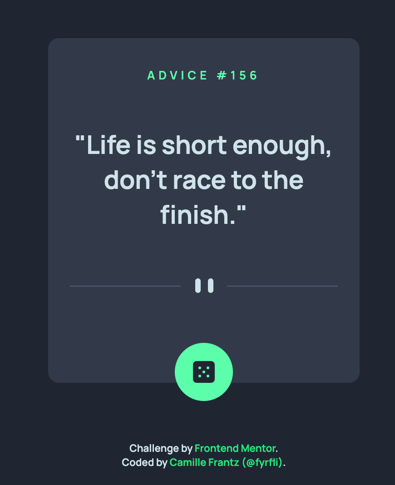

# Frontend Mentor - Advice generator app solution

[@fyrfli](https://www.frontendmentor.io/profile/fyrfli)'s solution to the [Advice generator app challenge on Frontend Mentor](https://www.frontendmentor.io/challenges/advice-generator-app-QdUG-13db). Frontend Mentor challenges help you improve your coding skills by building realistic projects.

## Overview

### The challenge

Users should be able to:

- View the optimal layout for the app depending on their device's screen size
- See hover states for all interactive elements on the page
- Generate a new piece of advice by clicking the dice icon

### Screenshot

### Links

- Solution URL: [Add solution URL here](https://your-solution-url.com)
- Live Site URL: [Add live site URL here](https://your-live-site-url.com)

## My process

### Built with

- Semantic HTML5 markup
- CSS custom properties
- Flexbox
- LessCSS

### What I learned
I learned mostly that if you don't use it, you lose it ... fast. I had to look up how to do event listeners again. 😆

## Author
- Website - [Camille Frantz (@fyrfli)](https://fyrfli.io)
- Frontend Mentor - [@fyrfli](https://www.frontendmentor.io/profile/fyrfli)
- Twitter - [@fyrfli](https://www.twitter.com/fyrfli)

